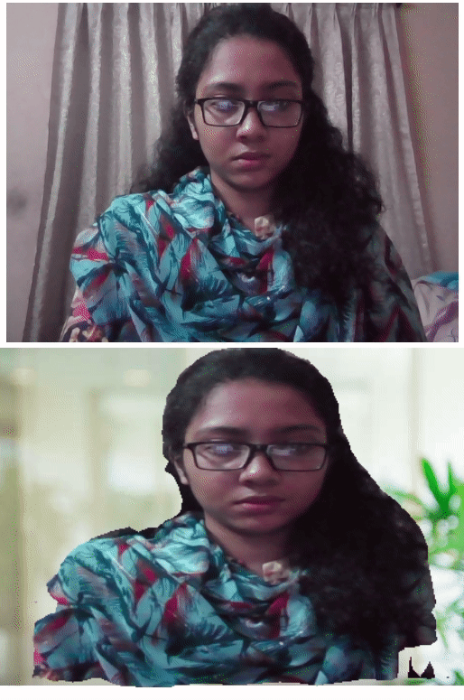

# Video-Background-Removal
1. Green Screen Background removal: 
* greenScreenRemoval.py uses color thresholding

# Demo
 

2. Chroma Keying: green screen effect javascript
* chromaKeyingGreen.html, processor.js on media/original.mp4
* For realtime, use chormaKeying.html -> change r, g, b range for used background color.
* ref- https://developer.mozilla.org/en-US/docs/Web/API/Canvas_API/Manipulating_video_using_canvas

3. Tensorflow.js Bodypix() model for person segmentation: 
* architecture: mobilenet
* ref- https://github.com/tensorflow/tfjs-models/tree/master/body-pix

4. Tensorflow.js deeplab model for semantic segmentation
* pretrained model on 'pascal' dataset 
* ref- https://github.com/tensorflow/tfjs-models/tree/master/deeplab

# Demo

